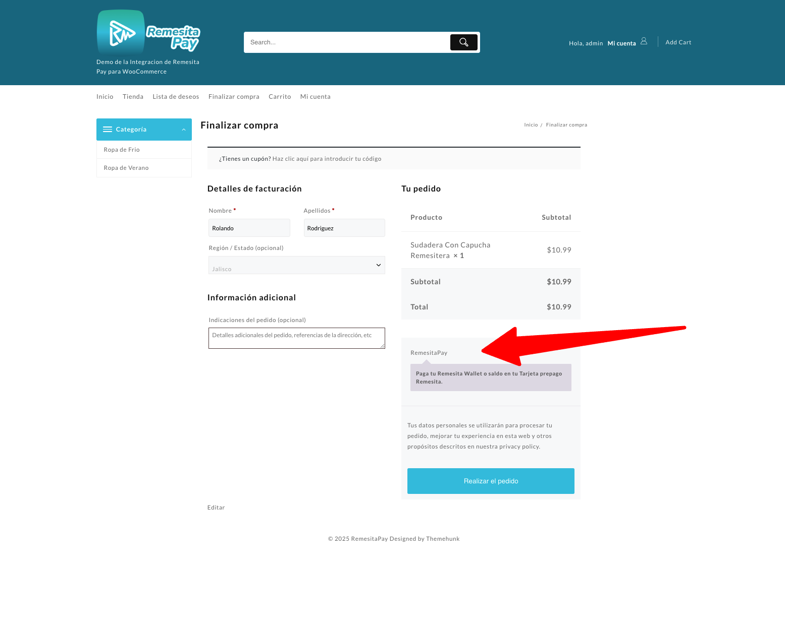

# Remesita Pay for WooCommerce

Plugin de pasarela de pago para WooCommerce que permite a tus clientes pagar de forma segura a través de Remesita.

## Descripción

Remesita Pay for WooCommerce integra la plataforma de pagos Remesita en tu tienda WooCommerce, permitiendo a tus clientes realizar pagos de manera rápida y segura. Este plugin es ideal para negocios que desean ofrecer una alternativa de pago confiable y sencilla.

## Características

- Integración completa con WooCommerce.
- Pagos seguros a través de Remesita.
- Configuración sencilla desde el panel de administración de WordPress.
- Compatible con las últimas versiones de WooCommerce y WordPress.
- Personalización de estilos y textos.
- Soporte para múltiples idiomas.

## Requisitos

- WordPress 5.0 o superior.
- WooCommerce 4.0 o superior.
- Cuenta activa en Remesita.

## Instalación

1. Descarga el plugin o clónalo desde este repositorio.
2. Sube la carpeta `remesita-pay-for-woocommerce` al directorio `/wp-content/plugins/` de tu instalación de WordPress.
3. Activa el plugin desde el menú “Plugins” en WordPress.
4. Ve a WooCommerce > Ajustes > Pagos y habilita “Remesita Pay”.
5. Configura tus credenciales de Remesita (API Key, Secret, etc.) en la sección de ajustes del plugin.

## Configuración

1. Ingresa a tu panel de administración de WordPress.
2. Dirígete a WooCommerce > Ajustes > Pagos > Remesita Pay.
3. Introduce tus credenciales de Remesita.
4. Personaliza los textos y estilos según tus necesidades.
5. Guarda los cambios.

## Uso

Una vez configurado, tus clientes verán la opción de pagar con Remesita en el checkout de tu tienda WooCommerce. Al seleccionar esta opción, serán redirigidos a la pasarela de pago de Remesita para completar la transacción.

## Capturas de pantalla

A continuación se muestran capturas de pantalla del plugin en acción:

### 1. Opción de pago Remesita en el checkout de WooCommerce



### 2. Pantalla de pago en la plataforma Remesita


> **Nota:** Guarda las imágenes proporcionadas en la carpeta `assets/` con los nombres `checkout-remesita.png` y `pago-remesita.png` para que se muestren correctamente en la documentación.

## Soporte

Para soporte técnico, reportar errores o sugerencias, por favor abre un issue en este repositorio o contacta al equipo de Remesita.

## Contribuciones

¡Las contribuciones son bienvenidas! Si deseas mejorar este plugin, por favor haz un fork y envía un pull request.

## Licencia

Este plugin está licenciado bajo la licencia MIT.

```
MIT License

Copyright (c) 2025 Remesita

Permission is hereby granted, free of charge, to any person obtaining a copy
of this software and associated documentation files (the "Software"), to deal
in the Software without restriction, including without limitation the rights
to use, copy, modify, merge, publish, distribute, sublicense, and/or sell
copies of the Software, and to permit persons to whom the Software is
furnished to do so, subject to the following conditions:

The above copyright notice and this permission notice shall be included in all
copies or substantial portions of the Software.

THE SOFTWARE IS PROVIDED "AS IS", WITHOUT WARRANTY OF ANY KIND, EXPRESS OR
IMPLIED, INCLUDING BUT NOT LIMITED TO THE WARRANTIES OF MERCHANTABILITY,
FITNESS FOR A PARTICULAR PURPOSE AND NONINFRINGEMENT. IN NO EVENT SHALL THE
AUTHORS OR COPYRIGHT HOLDERS BE LIABLE FOR ANY CLAIM, DAMAGES OR OTHER
LIABILITY, WHETHER IN AN ACTION OF CONTRACT, TORT OR OTHERWISE, ARISING FROM,
OUT OF OR IN CONNECTION WITH THE SOFTWARE OR THE USE OR OTHER DEALINGS IN THE
SOFTWARE.
```

Consulta el archivo [LICENSE](LICENSE) para más detalles.

## Créditos

Desarrollado por el equipo de Remesita.

---
¿Tienes dudas o necesitas ayuda? Escríbenos a info@remesita.com
